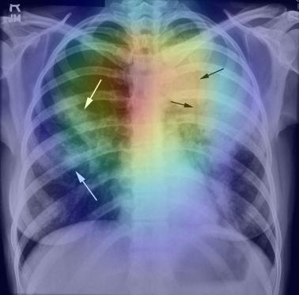

# pneum-detect-xai
Pneumonia Detection on Chest X Rays with Explainable AI (Grad-CAM)

Disclaimer: The model, code or recommendations provided are for educational and research purposes only. It is not intended for clinical use in any capacity without further validation and regulatory approval.

A deep learning model for pneumonia detection with visual explanations.

1. Introduction
   
   This project uses a convolutional neural network (CNN) to detect pneumonia from chest X-ray images and explains its predictions using Grad-CAM heatmaps.
   As a doctor, my aim was to develop a tool that is sufficiently accurate, clinically relevant, and interpretable, with potential to aid screening in resource        poor medical settings.
   Exaplainable AI is particularly helpful in this context as it can enable the physician (or any other allied healthcare worker) to visually confirm the presence     of lesions in radiographic imaging of patients of suspected pneumonia. It also allows physicians to understand the models attention patterns, which can             contribute to constructive feedback for fine tuning of ML systems.

3. Dataset
   
	Source: Chest X-Ray Images (Pneumonia) - Kaggle - https://www.kaggle.com/datasets/paultimothymooney/chest-xray-pneumonia

	Classes:

	NORMAL (healthy lungs)

 	PNEUMONIA (bacterial/viral)

	Split: Train / Validation / Test sets as per Kaggle defaults.

	Test set: kept completely unseen during training for unbiased evaluation.

3. Methodology
	Framework: TensorFlow/Keras (TF 2.x)
	Architecture: Custom CNN with dropout layers for regularization.
	Final layer: Sigmoid activation (binary classification).
	Loss: Binary crossentropy.
	Optimizer: Adam.
	Training: 10 epochs, batch size = 32.
	Threshold tuning: Adjusted to maximize sensitivity/specificity trade-off.

4. Results
<table>
  <tr>
    <th>Metric</th>
    <th>NORMAL</th>
    <th>PNEUMONIA</th>
    <th>Overall</th>
  </tr>
  <tr>
    <td>Precision</td>
    <td>0.80</td>
    <td>0.91</td>
    <td>—</td>
  </tr>
  <tr>
    <td>Recall (Sens.)</td>
    <td>0.85</td>
    <td>0.87</td>
    <td>—</td>
  </tr>
  <tr>
    <td>F1-score</td>
    <td>0.83</td>
    <td>0.89</td>
    <td>—</td>
  </tr>
  <tr>
    <td>Accuracy</td>
    <td>—</td>
    <td>—</td>
    <td>0.87</td>
  </tr>
</table>

**Confusion Matrix:**
<pre>
[[200  34]
 [ 49 341]]
</pre>

<b>Sensitivity (Recall for PNEUMONIA):</b> 87% 
<b>Specificity (Recall for NORMAL):</b> 85%

XAI input image, heatmap and heatmap superimposed image included.

5. Limitations & Future Work
   
	Despite overall general trend of correct region interest, the Grad-CAM models suffered to accurately dilineate lesions in some cases of pneumonia (espcially in 		cases of viral pneumonia that show diffuse involvement in contrast to lobar pathologies).

	Potential improvements and additions:
	-Improved data diversity
	-Experimenting with DenseNet or EfficientNet backbones
	-Adding uncertainty estimation
	-Potential integration with existing X Ray software setups

7. Acknowledgments
   
	Dataset - Paul Timothy Mooney (Kaggle dataset)
	TensorFlow/Keras team for deep learning framework.
	Grad-CAM implementation inspired by official TensorFlow tutorials.
